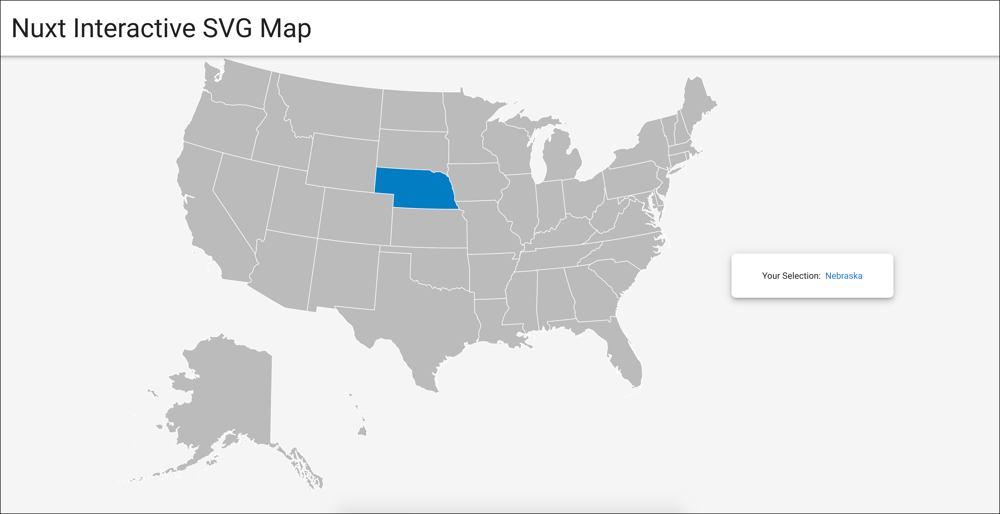

# nuxt-svg-map
## Overview
An interactive svg map for Nuxt built using [VictorCazanave/vue-svg-map](https://github.com/VictorCazanave/vue-svg-map).  
Requires **"vue-svg-map"** and **"@svg-maps/usa"** npm packages. 

This example uses the **USA** map and the **radio button** functionality provided by vue-svg-maps.   
For different maps, referrence: [VictorCazanave/svg-maps](https://github.com/VictorCazanave/svg-maps).  

I also selected **Vuetify** during setup so it uses that as well.  



## Build Setup

```bash
# install dependencies
$ npm install

# serve with hot reload at localhost:3000
$ npm run dev

# build for production and launch server
$ npm run build
$ npm run start

# generate static project
$ npm run generate
```

For detailed explanation on how things work, check out [Nuxt.js docs](https://nuxtjs.org).
